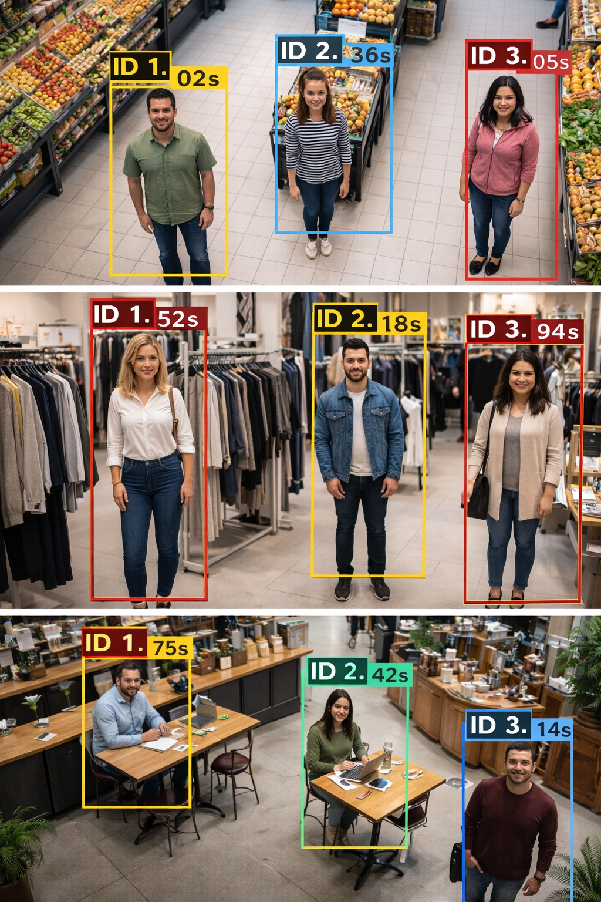

# Dwell Time Monitoring System – README

## Project Overview:

This system tracks people in a video stream and calculates the time spent (dwell time) in a defined area.

### It can be used for:

1. Retail store analytics
2. Robot interaction monitoring
3. Customer engagement analysis

### Technologies Used:

1. Python
2. OpenCV
3. Deep Learning-based object detection
4. Tracking algorithms

###  How It Works:

1. Detect persons in frame
2. Assign unique ID to each detected person using DEEPSORT
3. Track movement across frames
4. Remebers person if that person returns in the frame within 3 seconds
5. Calculate time spent in defined region
6. Display dwell time on screen

### How to run:

1. run requirement.txt in terminal
2. run opencv.py
